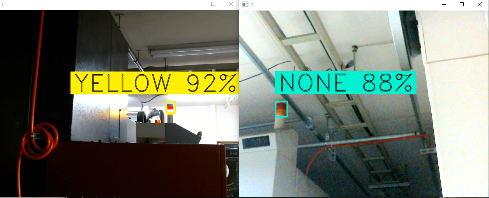

# Machine Status Notifier

産業機械の積層灯の点灯（黄色、赤色）を検知し、通知が必要な時間帯（平日18時〜、祝日・休日）であれば、LINE Notifyを利用してユーザーに通知します。

# 1. 環境構築

### venv
Linux、macOSの場合
~~~terminal
python3 -m venv venv
source venv/bin/activate
pip install -r requirements.txt
~~~

Windowsの場合
~~~terminal
python3 -m venv venv
venv\Scripts\activate.bat
pip install -r requirements.txt
~~~

# 2. TOKEN の編集
[LINE Notify](https://notify-bot.line.me) にアクセスし、通知を送信したいトークルームに対するトークンを発行する。 
発行したトークンを **config.json**にコピー＆ペーストする。

# 3. プログラムの実行

~~~terminal
python3 src/main.py
~~~